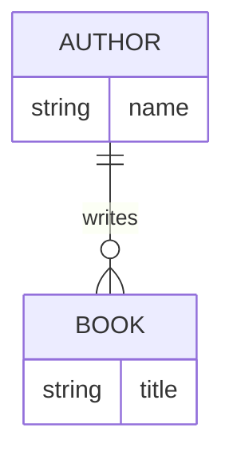

# Books

## Description

An author may write one or more books. A book must have an author.

## ERD Diagram

```mermaid
erDiagram
    AUTHOR ||--o{ BOOK : writes
    AUTHOR {
        string name
    }
    BOOK {
        string title
    }
```