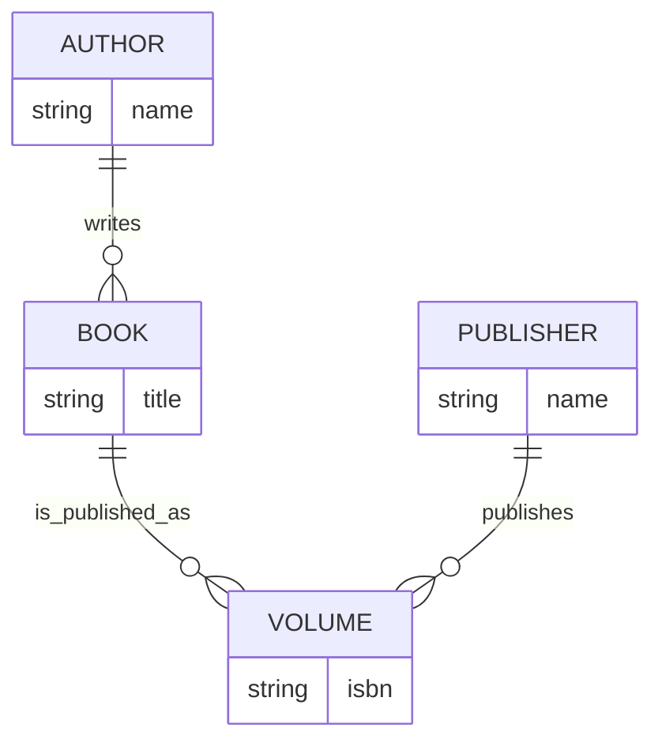

# Books

Extend and update the original `create-database.sql` to add the following functionality...

## Description

A book can be published by a publisher. Each published volume - even if the book and author are the same, has a unique ISBN.

You can assume that all publishers publish all of our known books.

## ERD Diagram

## List of Publishers
- Puffin Books
- Palgrave Macmillan
- Thames & Hudson
- Penguin Books

## ISBN Numbers 
These are 13 digits long, for example: 9781529151145. Feel free to make these up.